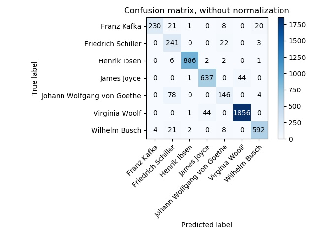
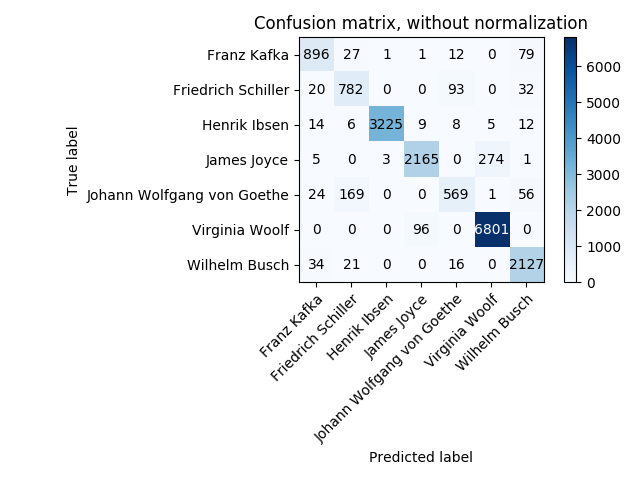

# Classification results for author classification
This page contains the classification results for the various algorithms, letter author classification

## Classifier: Perceptron with word bi-grams
- Algorithm: Scikit-learn perceptron
- Features: word bigrams in addition to single words
- Reported by: Stefan Langer

### Performance

- Seconds used for training: 180
- Seconds used for classification: 17

### Classification report
                                  precision    recall  f1-score   support

                     Franz Kafka       0.95      0.92      0.93       280
              Friedrich Schiller       0.80      0.77      0.79       266
                    Henrik Ibsen       0.97      0.99      0.98       897
                     James Joyce       0.97      0.92      0.95       682
      Johann Wolfgang von Goethe       0.70      0.80      0.75       228
                  Virginia Woolf       0.97      0.99      0.98      1901
                   Wilhelm Busch       0.99      0.93      0.96       627

                        accuracy                           0.95      4881
                       macro avg       0.91      0.90      0.90      4881
                    weighted avg       0.95      0.95      0.95      4881

### Confusion matrix
      [[ 258    3    7    0    7    0    5]
       [   1  205    7    0   52    0    1]
       [   1    1  892    1    1    0    1]
       [   0    0    0  629    0   53    0]
       [   3   39    3    0  182    0    1]
       [   0    0    1   19    0 1881    0]
       [   9    7   12    0   17    0  582]]
			 
### Confusion Matrix (img)

## Classifier: Perceptron with single words
- Algorithm: Scikit-learn perceptron
- Features: single words
- Reported by: Stefan Langer

### Performance: 

- Seconds used for training: 66
- Seconds used for classification: 18

### Classification report

                                precision    recall  f1-score   support

                   Franz Kafka       0.98      0.82      0.89       280
            Friedrich Schiller       0.66      0.91      0.76       266
                  Henrik Ibsen       0.99      0.99      0.99       897
                   James Joyce       0.93      0.93      0.93       682
    Johann Wolfgang von Goethe       0.78      0.64      0.71       228
                Virginia Woolf       0.98      0.98      0.98      1901
                 Wilhelm Busch       0.95      0.94      0.95       627

                      accuracy                           0.94      4881
                     macro avg       0.90      0.89      0.89      4881
                  weighted avg       0.95      0.94      0.94      4881

 
### Confusion matrix: 

	[[ 230   21    1    0    8    0   20]
	 [   0  241    0    0   22    0    3]
	 [   0    6  886    2    2    0    1]
	 [   0    0    1  637    0   44    0]
	 [   0   78    0    0  146    0    4]
	 [   0    0    1   44    0 1856    0]
	 [   4   21    2    0    8    0  592]]
	 
### Confusion Matrix (img)

## Classifier: Logistic Regression with word bi-grams
- Algorithm: Scikit-learn logistic regression
- Features: word bigrams in addition to single words
- Reported by: Shuzhou Yuan, Shanshan Bai

### Performance

- Seconds used for training: 80
- Seconds used for classification: 0.05

                            precision    recall  f1-score   support

               Franz Kafka       0.89      0.88      0.89       998
        Friedrich Schiller       0.81      0.82      0.82       990
              Henrik Ibsen       1.00      0.98      0.99      3294
               James Joyce       0.95      0.90      0.93      2426
Johann Wolfgang von Goethe       0.79      0.74      0.76       806
            Virginia Woolf       0.97      0.99      0.98      6848
             Wilhelm Busch       0.93      0.97      0.95      2222

                 micro avg       0.94      0.94      0.94     17584
                 macro avg       0.91      0.90      0.90     17584
              weighted avg       0.94      0.94      0.94     17584

### Confusion matrix
Confusion matrix, without normalization
[[ 874   24    2    0   16    0   82]
 [  28  812    0    0  124    0   26]
 [  23    8 3232    8    5    2   16]
 [   4    1    3 2193    0  223    2]
 [  16  143    3    0  597    1   46]
 [   0    0    0  102    0 6746    0]
 [  32   12    1    0   18    1 2158]]
			  
### Confusion Matrix (img)

## Classifier: Perceptron with single words
- Algorithm: Scikit-learn perceptron
- Features: single words
- Reported by: Stefan Langer

### Performance: 

- Seconds used for training: 66
- Seconds used for classification: 18

### Classification report

                                precision    recall  f1-score   support

                   Franz Kafka       0.98      0.82      0.89       280
            Friedrich Schiller       0.66      0.91      0.76       266
                  Henrik Ibsen       0.99      0.99      0.99       897
                   James Joyce       0.93      0.93      0.93       682
    Johann Wolfgang von Goethe       0.78      0.64      0.71       228
                Virginia Woolf       0.98      0.98      0.98      1901
                 Wilhelm Busch       0.95      0.94      0.95       627

                      accuracy                           0.94      4881
                     macro avg       0.90      0.89      0.89      4881
                  weighted avg       0.95      0.94      0.94      4881

 
### Confusion matrix: 

	[[ 230   21    1    0    8    0   20]
	 [   0  241    0    0   22    0    3]
	 [   0    6  886    2    2    0    1]
	 [   0    0    1  637    0   44    0]
	 [   0   78    0    0  146    0    4]
	 [   0    0    1   44    0 1856    0]
	 [   4   21    2    0    8    0  592]]
	 
### Confusion Matrix (img)

